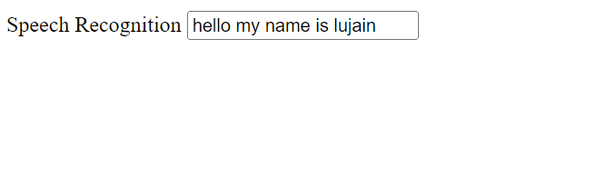

# Voice_Recognition
using an online HTML editor to create speech recognition. 

# Voice Recognition:

 A straightforward implementation of speech recognition capabilities on a web page is shown by the supplied HTML code snippet. With the help of this code, users will be able to speak text into an input field, which will subsequently be translated and displayed as text.

# HTML Structure:

The HTML structure is straightforward. It consists of a basic structure with a section. Within the section, necessary meta information and the title of the webpage are defined. The section contains the input field and the JavaScript code responsible for speech recognition.

# Input Area:

An input field is created using the <input> element with a type of "text". The label "Speech Recognition" is associated with the input field, which is intended to capture user input using speech. The placeholder attribute provides a hint to users about what type of input is expected. Additionally, the onclick attribute is assigned to the input field, linking it to the JavaScript function named record().

# JavaScript Code:

The JavaScript code embedded within the 
    <!-- end of script -->
    </body>

    </html>
    
# OutPut ScreenShot:

  
  
# Simulation:

 You can launch the project's simulation by clicking this link:
 [link](http://tpcg.io/TYGJMX)
